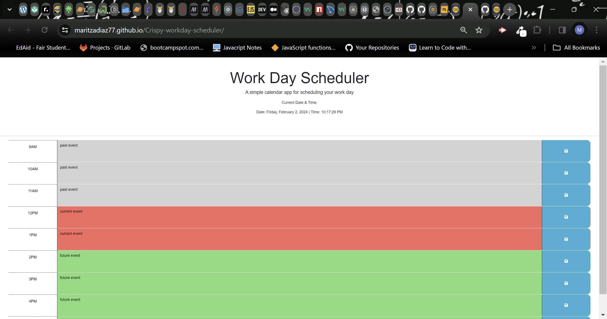

# Work Day Scheduler Starter Code

## Description
This is a simple calendar application that allows a user to save events for each hour of a typical working day (9am–5pm). This app will run in the browser and feature dynamically updated HTML and CSS powered by jQuery.

## Installation
N/A

## Usage

Below is the deployed URL:
https://maritzadiaz77.github.io/Crispy-workday-scheduler/

## Credits
I had a lot of help from W3 Schools and my tutor who asked me various questions that led me to my solutions to my problems in my application.

## License
N/A
